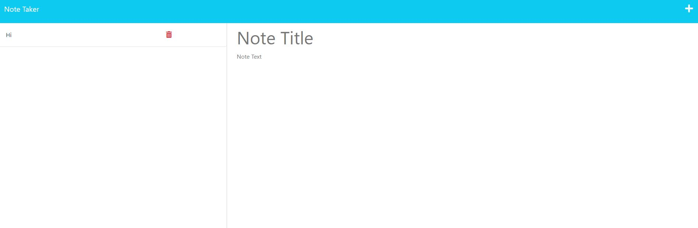

# Note-Taker
Take small notes or save to do-list items in your web browser. The notes will persist, even after you leave the site!
  

## Deployed Application
[Note Taker](https://guarded-sands-07079.herokuapp.com/notes)
  

## Local Usage Info 
If you intend to clone the repo and run the application locally, simply run *npm (/yarn/-your package manager-) i* and then *npm start* in the root directory.    
This will run the application on your local host server (3001).
  
## Challenge Description | User Story
### **AS A Small Business Owner**  
I WANT to be able to write and save notes,  
SO THAT I can organize my thoughts and keep track of tasks I need to complete.  

### **Acceptance Criteria**

GIVEN a note-taking application  
WHEN I open the Note Taker,  
THEN I am presented with a landing page with a link to a notes page.  
WHEN I click on the link to the notes page,  
THEN I am presented with a page with existing notes listed in the left-hand column, plus empty fields to enter a new note title and the note’s text in the right-hand column.  
WHEN I enter a new note title and the note’s text,  
THEN a Save icon appears in the navigation at the top of the page.  
WHEN I click on the Save icon,  
THEN the new note I have entered is saved and appears in the left-hand column with the other existing notes.  
WHEN I click on an existing note in the list in the left-hand column,  
THEN that note appears in the right-hand column.  
WHEN I click on the Write icon in the navigation at the top of the page,  
THEN I am presented with empty fields to enter a new note title and the note’s text in the right-hand column.  
 
## Note Taker Screenshot

